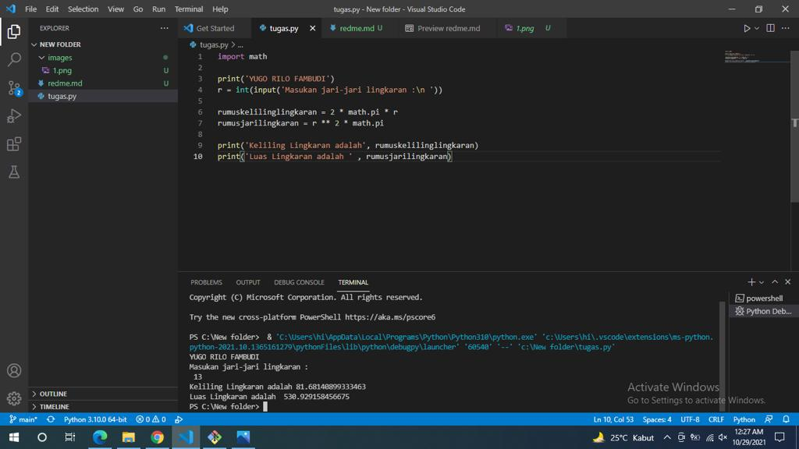

# <p align="center"> **TUGAS PEMROGRAMAN - KELILING & LUAS LINGKARAN**
[
<p align="justify">Tugas Bahasa Pemgrogaman membuat program untuk menghitung Luas & Keliling Lingkaran menggunakan bahasa pemrograman python.

---
<br>


# [tugas.py](https://github.com/YugoFambudi/Tugaspertemuan6./blob/main/tugas.py)

<p align="justify">Berisi syntax untuk menghitung Luas & Keliling dalam bahasa pemrograman python.

- Import Math, berfungsi untuk melakukan proses Matematika.
```sh
import math;
```
- Input jari-jari, menggunakan variabel integer.
```sh
r = int(input('Masukan jari-jari lingkaran:\n'));
```
- Menghitung proses keliling lingkaran.
```sh
//Math.pi berfungsi untuk menampilkan pi (3.14)

rumuskelilinglingkaran = 2 * math.pi * jari;
```
- Menghitung proses luas lingkaran.
```sh
//Math.pi berfungsi untuk menampilkan pi (3.14)
//** berfungsi untuk Exponentiation

rumusluaslingkaran = r ** 2 * math.pi;
```
- Print luas & keliling lingkaran.
```sh
print('Keliling Lingkaran adalah ', rumuskelilinglingkaran);
print('Luas Lingkaran adalah ', rumusjarilingkaran);
```
----
# Hasil Output Program Luas & Keliling Lingkaran
